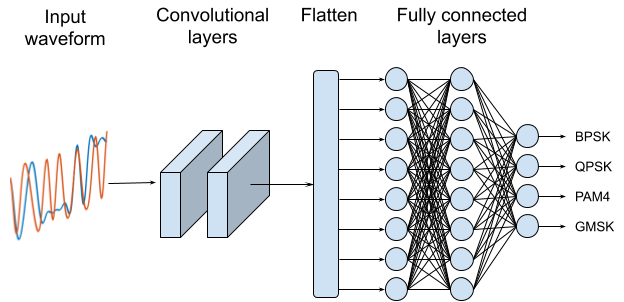

# amc_baby_models

This repo shows how to train a simple neural network for Automatic Modulation Classification (AMC) using a couple different frameworks. No reason to get tied down to one, right? Included is a tiny dataset generated using matlab with 4 classes (BPSK, QPSK, PAM4, GMSK) to use on all the jupyter notebooks.

</img>

## Included notebooks

* PyTorch 1.3
* Tensorflow 2.0 (with Keras)
* MATLAB